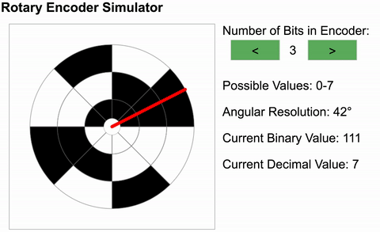

# RotaryEncoder Simulator
I built this simulator to explain how a rotary encoder works. More information is available at [wikipedia](https://en.wikipedia.org/wiki/Rotary_encoder).

See the [live demo](https://gmarzloff.github.io/RotaryEncoder/), and change the number of bits to see the effect on output values.

